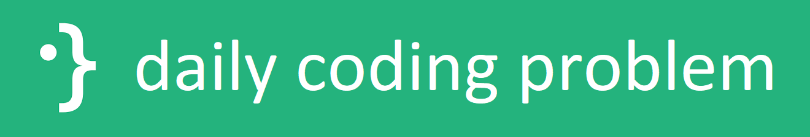

.. README.rst

daily coding problem
====================

Solutions to problems from `Daily Coding Problem`_, mostly in C++ [#]_.

.. [#] Currently, C++17 is my preferred specification, although I am interested
   in soon moving onto C++20.

.. _`Daily Coding Problem`: https://www.dailycodingproblem.com/

History
-------

Three years ago in 2019, during my sophomore year in college, I first
subscribed to Daily Coding Problem to get some interview practice. Now that I
am a "working adult", I have decided to rework some of these problems just to
refresh my brain and to practice writing some C++, which has become my
preferred language, although I have recently cleaned up some legacy C and
Python code in this repo as well.

Contents
--------

``cmake``
   Miscellaneous CMake_ scripts used in the C++ CMake_ build.

``include``
   C/C++ headers used by problem solutions in ``src`` or otherwise.

``legacy``
   Legacy code, mostly ugly Python solutions written back in 2019.

``src``
   C++ sources for each of the problem solutions, each buildable as a
   standalone `Google Test`_ runner.

``test``
   Unit tests for shared code, with a ``CMakeLists.txt`` that also uses the
   source files from ``src`` to build an overarching `Google Test`_ unit test
   runner with [almost] [#]_ all the available unit tests.

``xorll``
   An XOR linked list C implementation with a driver program used by
   ``legacy/xorll.py``, initially legacy code but recently refactored, cleaned
   up, and integrated into the CMake_ build.

.. _CMake: https://cmake.org/cmake/help/latest/

.. _`Google Test`: https://google.github.io/googletest/

.. [#] Standalone runners may have additional tests. See
   `Building from source`_ for details.

Dependencies
------------

`Google Test`_ >=1.10, any latest ``HEAD`` version is likely fine.

Building from source
--------------------

Note that standalone runners built from the sources in ``src`` are compiled
with ``PDDCP_GTEST_STANDALONE`` defined, enabling any code within constructs
like

.. code:: cpp

   #ifdef PDDCP_GTEST_STANDALONE
   // ...
   #endif  // PDDCP_GTEST_STANDALONE

Some standalone runners define additional `Google Test`_ tests within these
blocks.

\*nix
~~~~~

Building is easy with the provided ``build.sh`` build script. For usage, type

.. code:: bash

   ./build.sh --help

Windows
~~~~~~~

TBA. For now, see the comments in the top-level ``CMakeLists.txt``.
